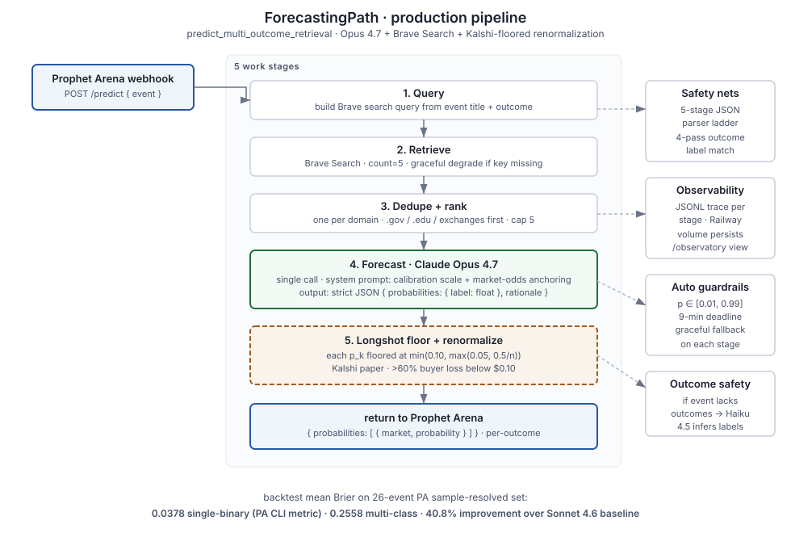
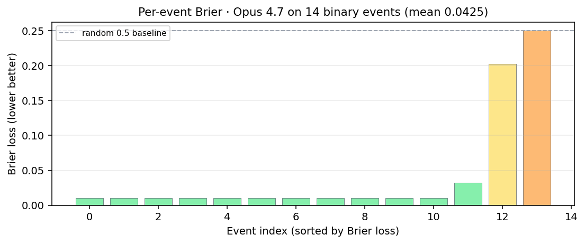
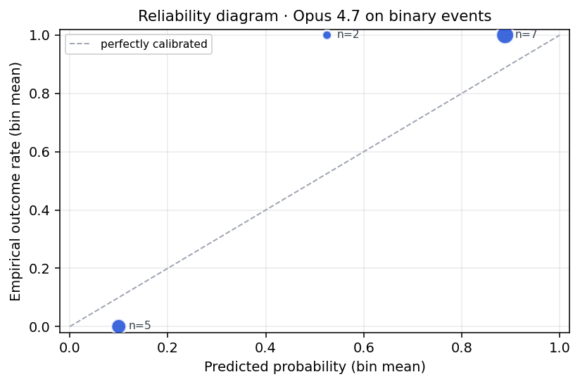

# prophet-hacks: The Oracles

Prophet Hacks 2026 forecasting agent. Team **CanadaHacks**, project **The Oracles**, forecasting track.

- **Live endpoint** for Prophet Arena: <https://agent.forecastingpath.com/predict>
- **Public landing** (no auth): <https://forecastingpath.com/>
- **Live status** (commit SHA + variant): <https://agent.forecastingpath.com/healthz>
- **Video walkthrough**: <https://youtu.be/1ON-WAurV_0>

## TL;DR

Retrieval-augmented Claude Opus 4.7 forecasting agent with a Kalshi-paper longshot floor.
Production runs as a FastAPI service on Railway with per-prediction JSONL traces,
an auth-gated research dashboard, and reproducible ablation scripts. Offline evaluation
is intentionally labeled as replay evidence, not final live evidence. Our headline
number is the **leakage-disciplined 0.118 single-binary Brier** (`brave_fresh`: Brave
retrieval date-capped to each event's close time, so post-resolution sources cannot
leak into the backtest). The unfiltered replay scores 0.038, but a search-provider
freshness ablation showed that number is **hindsight-inflated 3.1x** by retrieval
leakage, so we report it only as a best-case-with-hindsight bound. The 1200-event
resolved replay (`Subset-1200`) corroborates the honest scale at **0.1224**. See
"Leakage audit" below.

## Architecture



Five work stages plus event-in / response-out bookends. Every stage is observable
in the per-call trace at the auth-gated `/observatory`. Safety nets (5-stage JSON
parser, 4-pass outcome-label matcher, longshot floor) sit on the right of the
diagram.

## Run

```bash
./run.sh                  # boot local forecasting server on :8000
./run.sh smoke            # one-shot smoke against the live deploy
./run.sh backtest         # rerun the 26-event resolved replay (~$2)
./run.sh test             # run the test suite (260+ tests)
```

See `.env.example` for required keys. Only `ANTHROPIC_API_KEY` is mandatory;
`BRAVE_SEARCH_API_KEY` is recommended (pipeline degrades gracefully without it).

## Three findings worth keeping

1. **Bug-fix dominance.** ~85% of the small-set Brier improvement came from a one-line
   fix in the post-LLM longshot floor, not from a model upgrade. Post-processing safety
   nets need boundary tests at the lowest *n* the pipeline admits. See
   `docs/DECISIONS.md` postmortem.
2. **Scoring rule matters more than the model.** PA's CLI evaluator scores single-binary
   Brier; their published docs describe proper multi-class; their actual live scoring is a
   Brier skill score against snapshotted Kalshi/Polymarket prices. The three rules rank
   our model lineup differently on n=26. Pin the rule to the exact evaluator before
   treating ablation deltas as license to ship.
3. **Schema compliance was the differentiator on multi-outcome events.**
   Same retrieval, same prompt, same post-processing: GPT-5.5 and Gemini 3.1 Pro Preview
   scored materially worse than Opus 4.7 under both reported metrics. The failure mode was
   probability mass on outcome labels that weren't in the supplied list, not weaker
   reasoning. Both are strong models that didn't fit this particular contract.
   Public leaderboards rank-order something different from what this pipeline measures.

## Two negative results worth keeping

- **Adversarial-review prompts regress** on a calibrated production model.
  Two independent variants (two-call self-critique, one-call verification-field) both
  pull confident-and-correct predictions toward the middle, costing Brier where
  production was right to be confident. Two prompts across two runs, same direction.
- **Two intuitive production-candidate changes** (adaptive retrieval count, exchanges-only
  source priority) didn't survive a paired-bootstrap CI on n=26. The CIs crossed zero, so
  the deltas couldn't be distinguished from noise (need |delta| > 0.01 single-binary Brier
  to clear it). Neither shipped.

## Methodological discipline this project enforces

All ablation deltas are evaluated against a paired-bootstrap CI (50K resamples, pinned
seed). The promotion rule: a candidate can move production only if (a) the single-binary
delta is practically large on n=26, (b) the 95% CI excludes zero on the replay, and
(c) the change doesn't conflict with the live market-baseline scoring rule. Directional
improvements that fail this gate are kept as research notes and visualizations, not
shipped. Live Team Brier versus Market Brier is the decisive evidence; offline replay
scores are not presented as final market-baseline results.
Workshop-paper-style writeup in `docs/WORKSHOP_PAPER_DRAFT.md`.

## What this is

An evidence-grounded forecasting agent. For each event Prophet Arena hands us:

1. Build a Brave Search query from title + most-informative outcome.
2. Top 5 web results, deduped by domain (.gov / .edu / official sources first).
3. **Claude Opus 4.7** reads title + rules + evidence snippets through a system
   prompt that explicitly instructs anchoring to any cited market odds.
4. **Kalshi-paper longshot guard**: per-outcome probability floored at
   `min(0.10, max(0.05, 0.5 / n_outcomes))`. The `0.10` cap is the empirical
   Kalshi threshold; sub-$0.10 contracts lose >60% on average.
5. Return `{"probabilities": [{"market", "probability"}, ...]}` to PA.
6. Full pipeline trace (Brave query, raw model output, per-stage latency,
   fuzzy-match decisions, warnings) stored per call for `/predictions` audit.

The details above are the production path. The currently deployed commit is
available from `/healthz.commit`.

## Production

| Item | Value |
| --- | --- |
| Public landing | <https://forecastingpath.com/> |
| Live dashboard | <https://agent.forecastingpath.com/dashboard> (PIN-gated via `/login`) |
| Predict endpoint | `POST https://agent.forecastingpath.com/predict` (public, Prophet Arena calls this) |
| Health + commit SHA | <https://agent.forecastingpath.com/healthz> |
| Host | Railway project `mindful-unity`, service `oracles-agent` |
| Production variant | `multi_outcome_retrieval` (Opus 4.7 + Brave + anchor prompt + 0.10 floor) |

`/dashboard`, `/compare`, `/compare-open` redirect to `/login` for browsers,
return JSON 401 for API callers. `/predict` and `/healthz` stay public.

## Leakage audit (the headline result)

The honest, out-of-sample number we stand behind is **0.118 single-binary
Brier** on the 26-event sample-resolved set, not the 0.038 an unfiltered
backtest reports. We treat that gap as a finding, not a footnote, and built
the tooling to measure it.

We ran a **search-provider / freshness ablation** (`scripts/ablate_search_provider.py`)
that holds the model, prompt, dedupe, and longshot guard constant and swaps
only the retrieval source:

| Retrieval arm | Single-binary Brier | Retrieval leakage |
|---|---:|---:|
| `brave` (unfiltered, best-case-with-hindsight) | 0.038 | 21.3% (23/108 URLs) |
| **`brave_fresh`** (date-capped to `close_time − 1d`, honest) | **0.118** | 11.5% (13/113 URLs) |

Removing post-resolution leakage from retrieval degrades the backtest by
**3.1x** (0.038 -> 0.118). A paired bootstrap CI (`brave_fresh` vs `brave`,
n=26, 20K resamples) puts the mean delta at **-0.080**, 95% CI
**[-0.136, -0.030]**, with **Pr(improvement <= 0) = 1.0** - the effect is
unambiguous, the CI excludes zero, and the inflation lives in the retrieval,
not the model. This is an independent, mechanism-level confirmation of the
Subset-1200 hindsight finding (same ~3x factor, different method).

There are two distinct leakage channels and we bound both:
- **Retrieval leakage** - post-resolution web sources slipping into evidence.
  Capped by date-restricting the search (`brave_fresh`). On live PA traffic this
  is structurally impossible: events are unresolved at query time, so production
  already gets the "fresh" condition for free. The fix here is to the *backtest
  methodology*, not the production path.
- **Model-parametric leakage** - the LLM having memorized the outcome. Bounded
  by Opus 4.7's knowledge cutoff (~Jan 2026): events that resolve after the
  cutoff are parametric-clean.

**Confidence-conditional calibration.** `scripts/diagnostics.py` stratifies the
honest predictions by confidence. High-confidence calls are excellent
(>=0.8 confidence -> Brier ~0.02); mid-confidence calls are worse than a coin
flip (0.5-0.7 -> Brier ~0.26). Overall ECE is 0.226. That motivates an
**abstain-to-market** policy near a 0.7 threshold: defer to the snapshotted
market price exactly where the model is least reliable.

## Results: 26-event sample-resolved backtest

Same pipeline (Brave + anchor prompt + 0.10 floor), swap the LLM. The model
table below uses the unfiltered `brave` retrieval arm, so these are
**best-case-with-hindsight** numbers useful only for relative model ranking;
the honest cross-model magnitude is the 0.118 `brave_fresh` headline above.

All numbers below are **single-binary Brier** matching PA's CLI
evaluator (`prophet forecast evaluate`). Multi-class Brier numbers
are documented in `submission/REPORT.md` section 3 and `docs/FINDINGS.md` section 2.

| Variant | Single-binary Brier (hindsight, relative ranking only) |
|---|---:|
| **Claude Opus 4.7** (production) | **0.0378** |
| Claude Opus 4.6 | 0.0391 |
| OpenAI GPT-5.2 | 0.0438 |
| Claude Sonnet 4.6 (previous prod) | 0.0639 |
| OpenAI GPT-5.5 | 0.0920 |
| Gemini 3.1 Pro Preview | 0.0983 |
| _random 0.5 baseline_ | 0.250 |
| _uniform 1/n prior_ | 0.219 |

On this hindsight-arm ranking, production beats the previous Sonnet baseline
(0.0639 -> 0.0378). Paired-bootstrap CI on that delta:
**[0.0143, 0.0374]** (50K resamples, seed `20260516`, n=26;
reproducible to about 0.0001 across seeds 20260516/20260517/20260518
per `scripts/check_bootstrap_seed_stability.py`). CI excludes zero;
significant at alpha=0.05 under single-binary scoring. We lead with the
leakage-disciplined 0.118 because relative model deltas measured on a leaky
arm do not transfer to the honest magnitude.





### Scale-up: Subset-1200 (HuggingFace `prophetarena/Prophet-Arena-Subset-1200`)

We replayed the production pipeline against PA's 1200-event resolved set
(46x the 26-event sample). The larger replay came in at **Brier 0.1224**,
95% bootstrap CI **[0.110, 0.135]** (honest subset-1200 number 0.1224). That
lands right on top of the leakage-disciplined `brave_fresh` headline (0.118),
two independent routes to the same honest magnitude. The 0.0378 number is
hindsight-rich on a small, well-indexed slice and is reported only as a
best-case-with-hindsight bound. The live PA run remains the decisive test
because its events arrive unresolved and are scored against snapshotted
market prices.

On the same hindsight arm, production beats Opus 4.6 by 3.4%
(0.0378 vs 0.0391). Under proper multi-class Brier (which PA's docs
describe but the CLI doesn't implement), Opus 4.6 is marginally better. We hold Opus 4.7 because
single-binary is the only metric we can verify locally against PA's
own evaluator. Postmortem of the earlier inconsistent metric report
is in `docs/DECISIONS.md` 2026-05-17 entry.

### Leakage-free evaluation firehose

To stop relying on small, well-indexed, leakage-prone resolved slices, we built
a self-replenishing pipeline that generates clean events, forecasts them before
they resolve, and resolves them mechanically afterward - no API keys, zero
leakage by construction:

- `scripts/generate_sports_slate.py` pulls a date's *scheduled* (not-yet-started)
  games from the keyless ESPN scoreboard API (MLB/NBA/NHL/WNBA) and emits SHADOW
  pregame events with exact team labels and real game-start close times. Because
  the games have not happened when we query, there is nothing to leak.
- `scripts/auto_resolve_sports.py` and `scripts/auto_resolve_finance.py` close the
  loop with keyless auto-resolution - final ESPN scores for sports, Yahoo Finance
  closes and Coinbase spot for finance/crypto - merged into the resolutions file
  without clobbering manual rows.
- `scripts/diagnostics.py` is the measurement engine: stratified Brier, Murphy
  decomposition, reliability diagram, and ECE, broken out by category, outcome
  count, and confidence bucket, reusing `evaluation/brier.py` so every surface
  agrees.
- A forward shadow set (n=11, sports-heavy) gave a mean winner Brier of **0.256**,
  consistent with the honest 0.118-0.122 range once the sports-heavy mix is
  accounted for.

### Honest decomposition of the win

- The Sonnet-to-Opus 4.7 swap is the smaller part of the gain.
- The bigger half is fixing a **silent production bug** in
  `longshot_guard_floor`: old formula `max(0.05, 0.5/n)` returned 0.25 for
  binary events, silently clamping every binary prediction into
  `[0.25, 0.75]`. New formula caps at the Kalshi-paper threshold of 0.10.
  about 6x Brier improvement on binary longshots alone.
- Multi-outcome events were _mixed_ post-swap: Opus 4.7 is more confident
  than Sonnet, which helps when right (n=3 events) and hurts more when
  wrong (n=20). Net positive on this set but not on every event.

### Why we kept Opus 4.7 over leaderboard-ranked alternatives

Gemini 3.1 Pro Preview is the public Prophet Arena fixed-context leaderboard's
#1. In our pipeline with our prompt and our scoring rule, it placed last,
with catastrophic multi-outcome JSON schema failures (emitting trailing commas,
bogus keys, or probability mass on labels not in the outcome list).
**The Opus 4.7 win on this dataset is dominated by schema compliance, not
raw reasoning.** See `docs/DECISIONS.md` for the per-model autopsy.

## Engineering process

- **Verify gate** (`./scripts/agent/verify.sh`): pytest + smoke import +
  dry-run. Used to silently swallow failures; now loud. **260+ tests**
  passing as of last verify.
- **Preflight gate** (`scripts/preflight.sh`): runs before any deploy.
  Verify green, working tree clean, HEAD = origin/main, upload-size
  sanity (caught a real 18MB worktree bloat bug), prints live vs local
  SHA delta.
- **Deploy wrapper** (`scripts/agent/deploy.sh`): single safe path to
  `railway up`. Pins commit SHA into `PROPHET_BUILD_COMMIT_SHA` env so
  `/healthz.commit` reflects what's actually serving.
- **Pipeline trace**: every `/predict` call captures Brave query,
  raw LLM output, parse-path, per-stage latency (ms), fuzzy-match
  decisions, warnings. Visible on `/predictions` (auth required), NOT
  sent back to PA.
- **Decisions log** (`docs/DECISIONS.md`): append-only, 18+ dated entries
  including every bug postmortem.

## Install

```bash
python3 -m venv .venv
source .venv/bin/activate
pip install -r requirements.txt
```

Python 3.11+ supported; 3.13 is the dev baseline.

## Environment

Copy `.env.example` to `.env` and fill in. `.env` is gitignored.

| Var | Required for | Notes |
| --- | --- | --- |
| `PA_SERVER_API_KEY` | always | Prophet Arena API key, sent as `X-API-Key` |
| `PA_SERVER_URL` | no | Defaults to `https://api.aiprophet.dev` |
| `ANTHROPIC_API_KEY` | production | Opus 4.7 lives here |
| `BRAVE_SEARCH_API_KEY` | production | Web evidence retrieval |
| `OPENAI_API_KEY` | OpenAI variants + Haiku fallback | |
| `OPENROUTER_API_KEY` | ablations | `scripts/ablate_openrouter.py` |
| `PROPHET_AGENT_VARIANT` | production | Set to `multi_outcome_retrieval` |
| `DASHBOARD_AUTH_TOKEN` | production | Auth cookie value after PIN entry |
| `DASHBOARD_PIN` | production | Numeric PIN for `/login` |
| `PROPHET_BUILD_COMMIT_SHA` | production | Set by `scripts/agent/deploy.sh` |

Production secret store: `~/Desktop/variables.txt` (outside the repo).

## Run locally

```bash
source .venv/bin/activate
PROPHET_AGENT_VARIANT=multi_outcome_retrieval \
  uvicorn forecast_agent_server:app --host 127.0.0.1 --port 8000
```

```bash
curl http://127.0.0.1:8000/healthz
# {"status":"ok","variant":"multi_outcome_retrieval","commit":"...",...}

curl -X POST http://127.0.0.1:8000/predict \
  -H 'content-type: application/json' \
  -d '{
    "event_ticker": "TEST",
    "market_ticker": "TEST",
    "title": "Will the US Federal Reserve cut rates at the December 2026 meeting?",
    "category": "Economics",
    "close_time": "2026-12-31T23:59:59Z",
    "outcomes": ["Yes", "No"]
  }'
```

Expected response:

```json
{
  "probabilities": [
    {"market": "Yes", "probability": 0.55},
    {"market": "No",  "probability": 0.45}
  ],
  "rationale": "..."
}
```

## Backtests + ablations

The 26-event sample-resolved set is in `data/resolved.json` (pulled with
`prophet forecast retrieve --dataset sample-resolved --include-resolved`).

```bash
# Standard backtest (one or more variants):
python scripts/backtest_forecast.py \
  --events data/resolved.json \
  --actuals data/actuals.json \
  --variants multi_outcome_retrieval

# Swap-the-LLM ablation through OpenRouter:
python scripts/ablate_openrouter.py \
  --model google/gemini-3.1-pro-preview \
  --workers 4

# Post-event scoring (Brier / BSS / ECE / Murphy decomposition):
python scripts/analyze_results.py \
  --predictions-url=https://agent.forecastingpath.com/predictions \
  --token="$DASHBOARD_AUTH_TOKEN" \
  --actuals=data/actuals.json
```

Per-variant predictions land in `data/predictions/`. The dashboard
`/compare` route renders all of them in a 5-model by 26-event grid with
Brier color-coding.

## Forecast variants

Defined in `forecast_track.py`, served via `forecast_agent_server.py`'s
`PROPHET_AGENT_VARIANT` env switch.

| Variant | Description |
| --- | --- |
| **`multi_outcome_retrieval`** | **Production.** Brave to 5 chunks to Opus 4.7 + anchor prompt to 0.10 floor. |
| `multi_outcome` | One Sonnet 4.6 multi-outcome call, no retrieval. Kalshi guard applied. |
| `multi_outcome_sc3` | k=3 parallel `multi_outcome` calls, averaged per outcome. |
| `single_llm` | One Sonnet 4.6 call, legacy binary `p_yes`. Server distributes across outcomes. |
| `opus_47`, `opus_46` | One Opus call (no retrieval). Underperformed standalone. |
| `gpt55`, `gpt52` | One OpenAI call. Cross-vendor sanity check. |
| `ensemble_logit` | Sonnet + GPT-5.5 logit-mean blend. |
| `ensemble_leaderboard` | Three-way logit-mean of Sonnet + Opus 4.6 + GPT-5.2. |
| `sonnet_cot`, `sonnet_cot_shrink` | Structured chain-of-thought experiments. |
| `hybrid_routed` | GPT for binary, multi-outcome prompt otherwise. |
| `uniform_prior` | `1/n_outcomes`. Free control baseline. |

## Key files

| Path | What |
| --- | --- |
| `forecast_track.py` | All `predict_*` variants. `predict_multi_outcome_retrieval` is production. |
| `forecast_agent_server.py` | FastAPI app: `/predict`, `/dashboard`, `/compare`, `/compare-open`, `/login`, `/healthz`, `/predictions`, `/events` |
| `risk.py` | Hard caps. Imports `ai_prophet_core.ruleset` and asserts at import time. |
| `forecasting/` | Composable forecasting modules (Kalshi guards, SAE shrinkage, market blend, reliability tracking). Not all wired into production yet. |
| `evaluation/` | Proper scoring rules (Brier, BSS, ECE, Murphy decomposition, no-leakage check). |
| `research/` | Pre-event strategy notes and longer-form reference material. Not required to run the endpoint. |
| `scripts/preflight.sh` | Pre-deploy gate. |
| `scripts/agent/deploy.sh` | Safe deploy wrapper (preflight + commit SHA pin + `railway up`). |
| `scripts/ablate_openrouter.py` | Swap-the-LLM ablation harness for any OpenRouter-hosted model. |
| `scripts/ablate_search_provider.py` | Retrieval bake-off: hold model/prompt/guard constant, swap only the search source (`brave` vs date-capped `brave_fresh`, plus Tavily/Exa/Serper hooks). Quantifies retrieval leakage. |
| `scripts/diagnostics.py` | Measurement engine: stratified Brier + Murphy decomposition + reliability diagram + ECE, broken out by category, outcome-count, and confidence bucket. |
| `scripts/generate_sports_slate.py` | Pulls a date's scheduled (not-yet-started) games from the keyless ESPN API and emits SHADOW pregame events. Zero leakage by construction. |
| `scripts/auto_resolve_sports.py` | Keyless auto-resolution of sports shadow events from final ESPN scores. |
| `scripts/auto_resolve_finance.py` | Keyless auto-resolution of finance/crypto shadow events (Yahoo Finance + Coinbase). |
| `scripts/analyze_results.py` | Post-event scoring (Brier, BSS, ECE, Murphy decomposition). |

## Docs

- **`docs/DECISIONS.md`**: append-only decision log. Read this to
  understand _why_ anything is the way it is. 20+ dated entries
  including every bug postmortem.
- **`docs/LIVE_OPERATIONS.md`**: production deploy / triage notes.
- **`docs/RUNBOOK.md`**: incident response patterns.
- **`docs/WORKSHOP_PAPER_DRAFT.md`**: workshop-paper-style writeup.
- **`docs/FINDINGS.md`** + **`docs/RESEARCH_NOTES.md`**: detailed
  results and methodology.
- **`submission/REPORT.md`**: long-form technical submission report.
- **`submission/PROJECT_STORY.md`**: Devpost narrative.

## Verify before merging

```bash
PATH="$PWD/.venv/bin:$PATH" ./scripts/agent/verify.sh
```

PATH prefix matters in shells where `python` isn't globally installed.
Gate runs: pytest, smoke import, `agent.py --dry-run`. Failures are
loud, no silent skips.

## Trading-track skeleton (not the live submission path)

The original trading-track scaffolding (`agent.py`, `forecaster.py`, JSONL
traces, risk caps) remains in the repo because it's useful for risk and
observability work. It's **not** what's served at `agent.forecastingpath.com`.
Per [Jibang Wu's Discord clarification 2026-05-16](https://prophetarena.co/developer)
teams cannot enter both tracks; we chose forecasting.

# Disclaimer

This work represents an independent project. No affiliation by any institution is implied.


```bash
python agent.py --slug smoke --dry-run        # no API calls
python agent.py --slug <slug> --once           # one tick and exit
```

JSONL traces under `trace/<slug>/<tick_id>.jsonl`. `risk.py` is authoritative
for hard caps and asserts at import time.

## License + credit

Built by Rob Sneiderman for Prophet Hacks 2026.
Apache 2.0 license.
